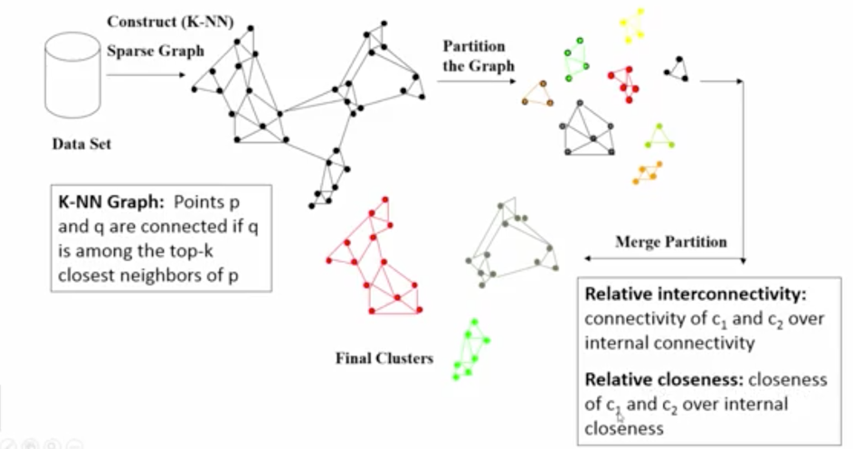
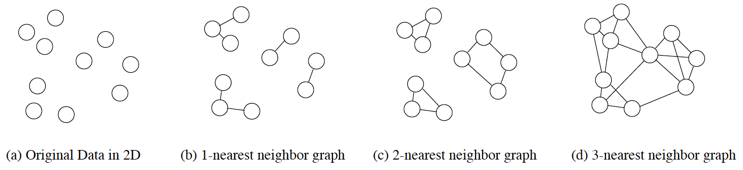
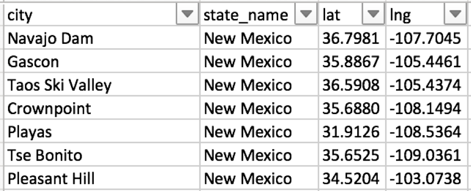

# Chameleon clustering algorithm

## Description of the algorithm

The following figure shows three steps of the algorithm's operation, which are described in detail in Figure 1. The algorithm's operation consists of three phases.



1. Step one
    * A graph is created containing all points from the test set
    * Leaving the edge according to the KNN algorithm
    * Breakdown into initial clusters by finding coherent components in the graphs - Depth-first search(DFS).



2. Step two:
    * Until the initial number of groups has been reached, the vertices of the largest cluster are divided into two parallel parts
    * Choosing the largest cluster
    * Cluster division into two parallel subgraphs depending on the distribution of points

3. Until the specified number k of clusters has been reached at the final input
    * Calculation of binding coefficient metrics (RI and RC) for all cluster pairs
        * EC (Ci) - average weight value (1 / distance) between vertices in the graph
        * RI (Ci, Cj) - coefficient of internal relations in the cluster(Relative Inter-Connectivity)

        ```Java
        RI = bothClustersEC * (firstClusterPointsNr + secondClusterPointsNr) /    (secondClusterPointsNr * firstClusterEC + firstClusterPointsNr * secondClusterEC)
        ```

        * RC (Ci, Cj) - coefficient of connection between two clusters (Relative Closeness)

        ```Java
        RC = bothClustersEC * (firstClusterPointsNr + secondClusterPointsNr) /
            (secondClusterPointsNr * firstClusterEC + firstClusterPointsNr * secondClusterEC)
        ```

    * For each pair of clusters, the product of RI times RC is calculated.
    * The pair with the smallest value of the product RI times RC are joined
    * Adding a new cluster to the list of clusters and deleting old clusters

## Data

A set of cities has been selected with an administrative division into states - https://simplemaps.com/data/us-cities

The data file contains 4 data for each city.
These are the city (city) name, state (state_name), longitude (Ing) and latitude (lat).

The data in the us-cities set is stored in the .csv text format



## Implementation

* The data is stored in the .CSV text format
* The algorithm is implemented in Java 8
* A description of the most important methods is available in the JavaDoc appended to the report and in the code comments

## Input data

* Data file
* k - Number of neighbors to the knn algorithm - step 1 of the algorithm (desired number of groups)
* m - expected number of groups
* n - number of subgroups - step 2 of the algorithm

## Testing the algorithm

Testing the algorithm will consist calculating accuracy and purity for a single group as well as for the whole set.

Accuracy is calculated as the ratio of the number of correctly grouped points (according to the original membership in the states) to the number of all points.
The purity of the grouping will be calculated as the number of different states in the group.

It was assumed that the state is counted as present in the group when there are at least three points belonging to this state.
The influence of the number of closest neighbors will be investigated - the first part of the algorithm, 
the number of subgroups - the 2nd step of the algorithm for the accuracy of grouping and the purity of groups.


## Conclusions

According to the conclusions presented in the article, the algorithm copes well with grouping distant groups as well as perfectly carries out classifications. For the sets of points close to each other, the algorithm is also doing very well.

The biggest problem is the selection of grouping parameters for the set on which the algorithm is performed.

For small sets, it must be taken into account that too large decrease in the k parameter responsible for the first phase of the algorithm will create many unorganized small clusters, while too high value of this parameter will result in clusters with too many points.

 The tests show that the best accuracy of the algorithm was obtained for the k parameter equal to the original number of groups predicted. Choosing the k parameter too small is definitely more important for later propagation of errors than too high value of this parameter.

The initial number of groups, and thus the parameter responsible for the second phase of the algorithm's operation, significantly affects the quality of calculating the RI and RC metrics for each cluster. The smaller the value of this parameter, the more numerous the groups are. On the other hand the bigger k parameter is the smaller groups become in the last merge phase of the algorithm. Too small and too many points in the cluster may result in incorrect calculation of metrics, and thus incorrect connection of clusters into groups.

The number of points on which the algorithm will operate also affects the way it works - for the correct calculation of RC, RI and EC metrics, large enough clusters are needed to determine the relationships between them, and small enough that the group does not contain too many points originally to other clusters.
Considering the above, the algorithm works very well. The influence of the input parameters is consistent with the predictions and the article describing the operation of the algorithm.

## Output data

Metrics assessing the correctness of clustering.
Graphic showing clustering.

## Compilation
`
javac Combiner.java
`

## Running

The jar should be run with 4 arguments:

1. File name with input data (including extension)
2. Parameter k (integer)
3. The initial number of clusters (integer)
4. Expected number of clusters at the program output (integer)

**Example:**

```bash
java Combiner myFileName.csv 3 15 3
```

## Example jar for this project 

The data folder in which the .csv files will be stored should be in the same location as the SPDB.jar file <br>

* Location  `/SPDB_jar/SPDB.jar`
 * File with an example data to run the project: `/SPDB_jar/data/utah_ariz_newMexico_colorado.csv`

 ```bash
 java -jar SPDB.jar utah_ariz_newMexico_colorado.csv 4 8 4 
 ```
 
 
